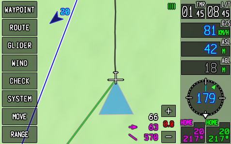

# G-NAV
G-NAV is an electronic flight instrument system (EFIS) for soaring. G-NAV is made by assembling together standard hardware and software modules, which means you can build (and repair) your own kit with a very little budget and without requiring a lot of technical skills. You can use G-NAV
for real applications or in a simulated environment.



> **NOTE:** G-NAV is not certified as an IFR equipment. Although a best effort is done to make the system as resilient and reliable as possible, you should never use this device as primary source of navigation or collision avoidance.

## Software

> **NOTE:** I am working on a web version of the software, which I hope will be ready on 2024! This new version will run on mobile phone web browsers, while keeping the same features and appearance.

The software solution is composed of a graphical application and possibly a middleware data aquisition system.
The development of the graphic application is the main focus of this project. The software that is required in the external hardware (SoftRF, Stratux, etc.) is not developed here.
G-NAV is almost entirely written in Ada and it is powered by OpenGL(ES) and either GLFW or SDL. It can run on any Linux system, including the Raspberry Pi OS (on models 3 and 4).
If you are using Raspberry Pi, make sure to use a recent version of the OS.
An interface for Java (JNI) is provided with the intention of creating an Android application, although this part of the project is not done yet.

## Hardware
For the hardware you will need:
- An ARM board (2GB RAM should be sufficent, though 4GB will not harm).
- 16 or 32 GB good quality micro SD to install the OS.
- 5" or 7" standard DSI touch screen.
- Hardware encasing (for the 3D printed parts, check the Hardware folder).
- For real application you will need a data aquisition system (providing GPS, Flarm and other capabilities).
- A powerbank (ideally at least 10Ah).

The SMI port for video is probably the best option to connect the screen, since it is very compact and does not use the GPIO ports. If the GPIO ports are used by the screen (like for some models of HyperPixel), you will not be able to install the wheel and the buttons directly to the board.

About the screen size, the 7" provided by Raspberry Pi can be too large to fit in most gliders (especially if the computer is not permanently installed on the dashboard). The 5" screen provides a good balance between size and legibility.

The ARM board that is beeing used are Raspberry Pi 3B and 4B. Other alternatives that should work as well (but have not been tested) are:
- Banana Pi BPI-M6
- Asus Tinkerboard

A RAM memory of 2GB should be sufficient in any case, although this has not been tested. Consider that the most memory demanding data is the terrain (which can easily reach up to 60MB for a decent grid), and there should be sufficient memory left for other data and tasks.

### GNSS:
For the hardware exploration model, an U-BLOX M8N GNSS chip is beeing used (U-BLOX provides a cost-effective solution). Be aware that it is important to find a proper antenna in order to get a stable signal in a wide range of GNSS systems. Even if your GNSS chip is able to process signals from several GNSS providers, the data it receives depends entirely on the antenna, so it is worth investing in a good one. Active antennas are preferable. Antennas provided by Taoglass, for example, are of good quality and not too expensive.

### SoftRF dongles:
Using the SoftRF dongles (T-Beam or T-Motion) will work directly and does not require of any middleware. Just plug one of the dongles on a free USB port, configure the right serial path on the startup file, and the application will start capturing and processing the NMEA and FLARM dataframes (make sure the dongle is correctly configured for NMEA/FLARM).

## Installation of G-NAV on Raspberry Pi
To install the application on your Rasperry Pi, simply clone this repository and then run the ./install.sh script:
```
$ git clone github.com/GuillermoHazebrouck/gnav/
$ cd gnav/Software/
$ chmod +x install.sh
$ sudo ./install.sh
```
The standar installation is based in GLFW. If you want to use SDL instead, you will need to install the necessary packages and adapt the scrip.
In the last command, use DEVEL as option for local development. Patches and replays can be done directly on the Raspberry Pi without the need of an extra PC.
When G-NAV is installed without the DEVEL option, it will run after each reboot in maximized screen size and it will restart automatically after any malfunction.

## Installation of G-NAV in a Linux PC
If you want to make serious changes to G-NAV, it is recommended you do it from a Linux PC. In that case, do not run the `install.sh` script, but simply use your package manager to install the OpenGL and GLFW or SDL development libraries. The Ada compiler can be obtained from [GNAT](https://www.adacore.com/download). It is recommended to use the Gnat community edition.
The scrip "build.sh" can be used to build the executable or a standalone library for Java.
```
$ ./build.sh EXE GLFW
```
or

```
$ ./build.sh LIB
```

## Running a recorded file
Every time the progam is launched, a recording is started (independently on the type of data streaming). The recording files are stored in $GNAV_PATH/Software/bin/replay/.

To replay a recorded file you need to adapt the "setup.dat" file to indicate that the data stream is a file:
```
FILE_STREAM=<your file name>
```

The protocol is automatically set from the replay file itself.

## Testing G-NAV in FlightGear

If you want to test the G-NAV computer in a simulated environment (to see if it is something for you before buying the hardware), you can use FlightGear in your Linux PC. This is actually very simple:

1. Install FlightGear.
2. Install G-NAV.
3. Copy the gnav/Software/etc/gnav_protocol.xml file into the FlightGear generic protocol configuration folder (typically "/usr/share/games/flightgear/Protocol/").
4. Launch FlightGear using the next options (note that FlightGear also provides a textbox in the graphic interface for this):
```
--generic=socket,out,4,<your network user id>,4000,udp,gnav_protocol
```
5. Launch Gavilan with the next setup options (setup.dat):
```
UDP_STREAM=4000
PROTOCOL=G-NAV"
```

